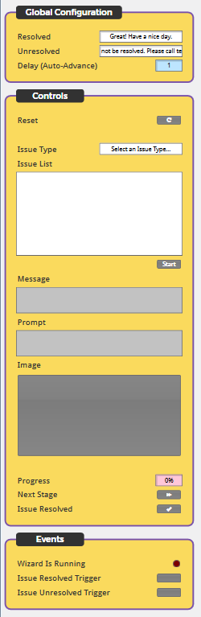
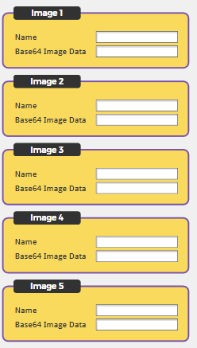
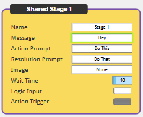
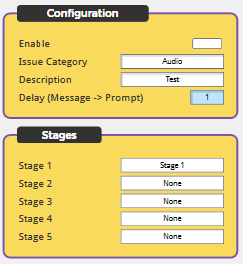

# TAG Help Wizard

This is a Q-SYS Plugin for creating a help Wizard on a user interface to assist users with common issues.

The Wizard does not house the logic or actions, but instead takes a ***boolean*** logic input for each ***stage*** of an ***issue***. It fires an ***action trigger*** if the logic is ***true***, and skips to the next ***stage*** if the logic is ***false***.

> Bug reports and feature requests should be sent to Jason Foord (jf@tag.com.au).

## How do I get set up?

See [Q-SYS Online Help File - Plugins](https://q-syshelp.qsc.com/#Schematic_Library/plugins.htm)

## Properties

#### Image Store Size

The number of configurable image slots in the Image Store

> Images are referenced by their name in ***shared stages***.

#### Total Stages

The maximum number of shared stages the can be configured.

> Shared Stages are referenced by their name in ***issues***.

#### Total Issues

The maximum number of Issues the can be configured.

#### Stages per Issue

The maximum number of stages the can be configured in each Issue.

#### Confirmation Timeout

The time to wait, once a user is prompted for resolution, before the Wizard automatically restarts.

## Wizard


### Global Configuration

#### Resolved

The message to display when the Wizard finishes in a resolved state.

#### Unresolved

The message to display when the Wizard finishes in an unresolved state.

#### Delay (Auto-Advance)

The delay between when a stage finishes in a resolved state, before automatically starting the next stage.

### Controls

#### Reset

Resets the Wizard manually.

#### Issue Type

The category of issue.

> This filters the issue list.

#### Issue List

The issues that are enabled and fall under the selected category.

#### Start

Starts the Wizard for the selected issue.

#### Message

The message to display for the current stage.

#### Prompt

The prompt to display for the current stage.

#### Image

The image to display for the current stage.

#### Progress

The progress for the current stage's wait time.

> 0 - 100%

#### Next Stage

User input - this stage ***did not*** resolve the issue. Runs the next stage.

#### Issue Resolved

User input - this stage ***did*** resolve the issue. Resolve the Wizard.

### Events

#### Wizard Is Running

Indicates if the Wizard is currently running.

#### Issue Resolved Trigger

Fires when the Wizard finishes in a resolved state.

#### Issue Unresolved Trigger

Fires when the Wizard finishes in an unresolved state.

## Image Store


#### Image 

 ##### Name

 The custom name to identify this image.

 ##### Base64 Image Data

 The Base64 image data to render. Use a Base64 encoder such as [base64-image.de](https://www.base64-image.de/).

> The data should not include the prepended '***data:image/png;base64,***'.

## Shared Stages


 ##### Name

 The custom name to identify this shared stage.

 ##### Message

 The message passed to the Wizard's message field when this stage runs.

 ##### Action Prompt

 The prompt passed to the Wizard's message field when this stage's action triggers.

 ##### Resolution Prompt

 The prompt passed to the Wizard's message field when this stage's action does not trigger.

 ##### Image

 The image passed to the Wizard's image display when this stage's action triggers.

 > This is a button that is rendered with a .Legend Property of:

 ```lua
rapidjson.encode({
    DrawChrome = false,
    IconData = data -- base64 encoded image data
})
```

 ##### Wait Time

 The time to wait when the action is triggered before allowing the user to give confirmation.

> If the logic input changes to ***false*** during the wait time, the wait time will complete and the user will be able to give confirmation. This is because the logic is now indicating that the problem has been fixed.

 ##### Logic Input

 The logic that determines whether the the stage should run an action or not.

> ***true*** results in the action being triggered.

> ***false*** results in the stage being resolved.

 ##### Action Trigger

 The trigger control that fires when the action is triggered.

> This should be used to trigger a corrective action in your design that should fix the issue.

## Issues


 ##### Enable

 If this issue is compiled into the Wizard list.

 ##### Issue Category

 The category name that this issue should be listed under.

 ##### Description

 The description of this issue that should appear in the issue list.

 ##### Delay (Message => Prompt)

 The delay between the message being display, and the prompt being displayed.

> Longer delay times allow more time for the user to process the information as the Wizard runs through a stage.

 ##### Stage ***X***

> The name of the shared stage to run.